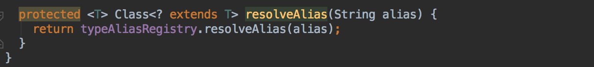
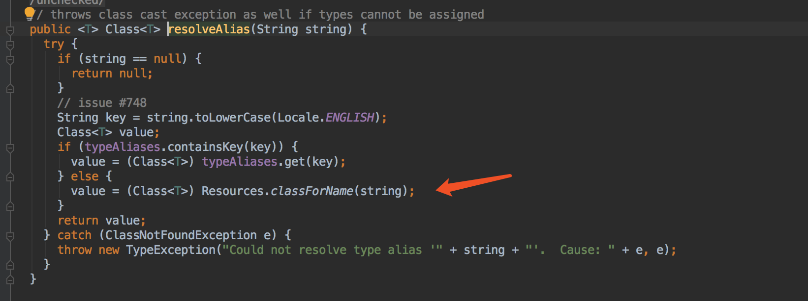

## Mybatis xml解析流程

### mybatis-config.xml

SqlSessionFactoryBuilder主要功能

1. 解析xml文件，生成configuration对象
2. 通过configuration对象生成SqlSessionFactory

#### 生成xmlConfigBuilder 

​	主配置文件解析者。开始解析

首先判断是否解析过。

解析根节点configuration

#### XPathParser

mybatis在XPath上封装的xml解析工具。

XPathParser的解析节点方法evalNode()，最终调用xpath.evaluate(),返回Node对象，在进一步封装为XNode。

#### XNode

mybatis对Node的进一步封装。包含当前解析器XPathParser,Node

解析主逻辑

依次解析mybatis-config的二级标签。

#### properties

处理规则：

1. 读取properties下的属性配置。

2. 读取外部配置

3. 读取configuration已有配置

   后读取配置会覆盖前面的，所以配置 属性优先级， configuration>外部配置>properties下配置

#### settings

//TO-DO metaClass暂时不清楚

读取settings节点下的配置

设置vfs和logImpl

#### typeAliases

注册typeAlias

1. package方式，先查找目录下的所有需要注册进去的类
2. 每一需要注册的类，默认type为类名第一个字母小写，如果类存在Aliase注解，则用注解上的指定type

#### plugins

#### objectFactory

通过type反射生成对应的实列，读取配置，放入实例中，最终将实例赋予configuration对象

##### 反射逻辑

最终调用的是typeAliaseRegister的方法

在缓存中存在则直接用，否则再通过Resources反射获取

#### objectWrapperFactory，reflectorFactory

同objectFactory，

####设置自定义配置

#### environments

环境读取

先读取启用的配置关键字。

在isSpecifiedEnvironment()方法匹配 是否是 启用配置

开始解析，分别获取事物工厂和数据源工厂，和前面的相同，通过反射处理。

再通过构造者模式赋值，并构建Environment, 放回configuration中。

#### databaseIdProvider

主要是根据dataSource数据源去获取dataBaseId

以VendorDatabaseIdProvider为例

最终是通过读取连接的信息，最后和配置进行匹配返回。

#### typeHandlers

和typeAliases类似

最终注册逻辑

两层map，第一次key为javaType,第二层key为JdbcType.

#### 最终的mapper

4种方式，

1. package
2. url
3. resource
4. class

最终交给XMLMapperBuilder解析