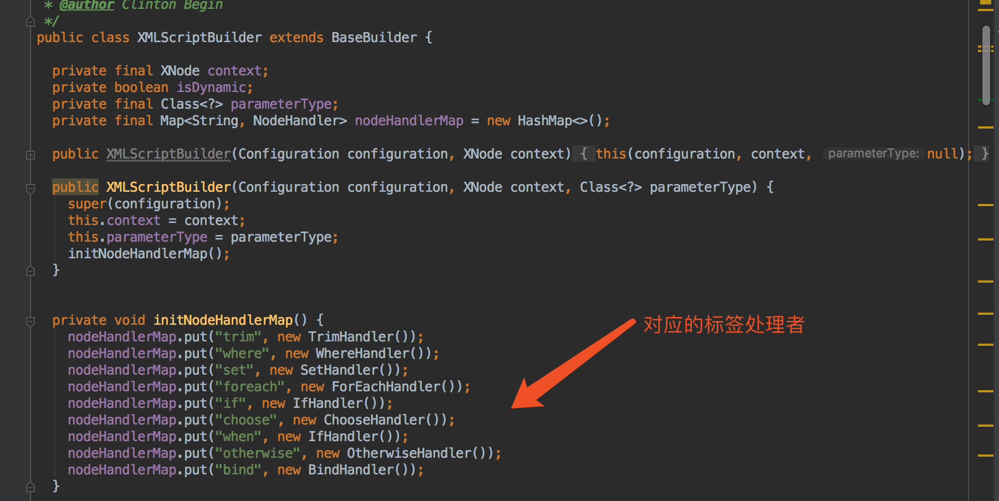
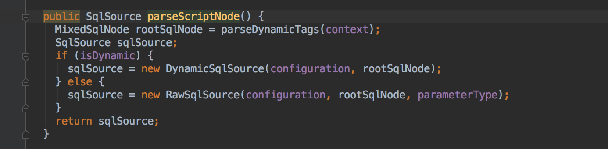
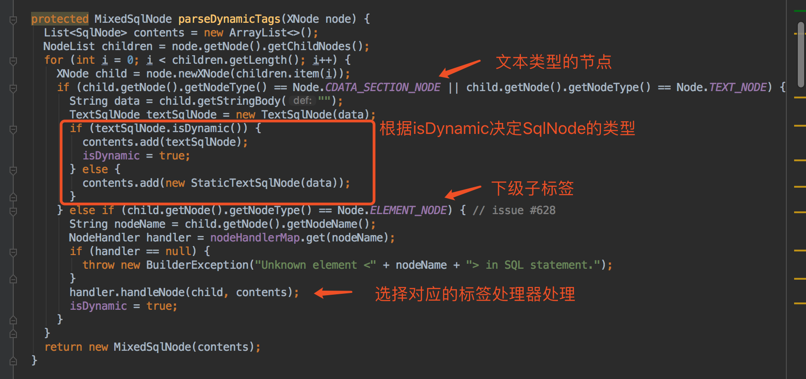
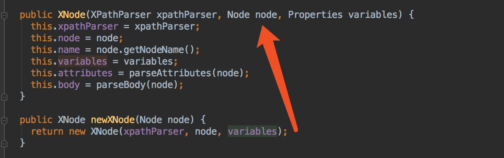
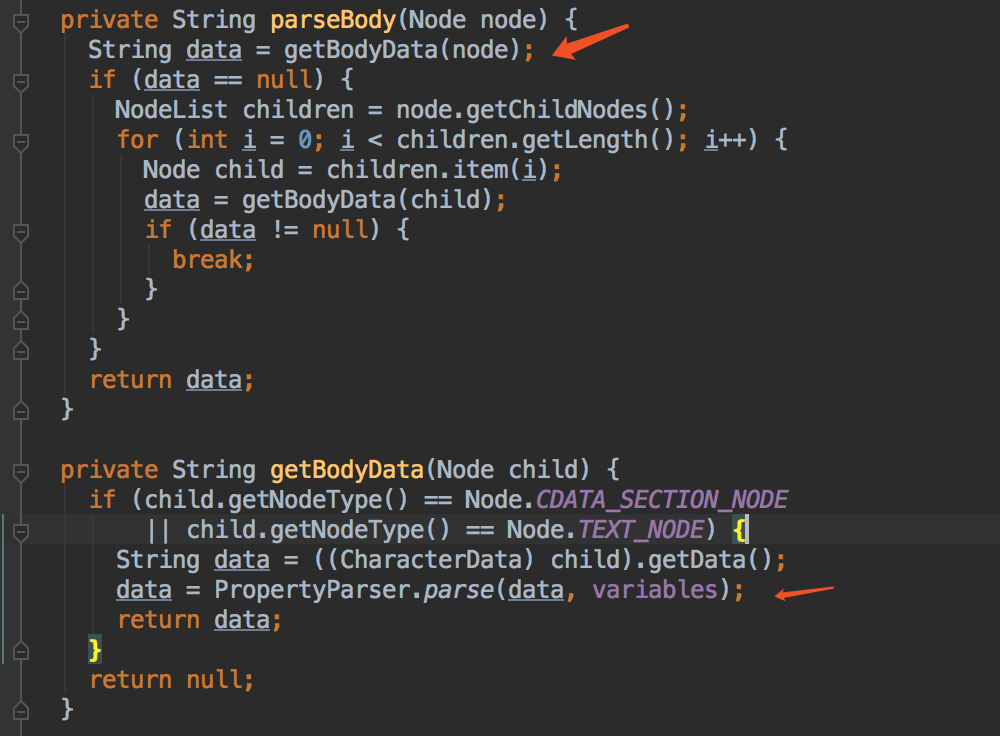
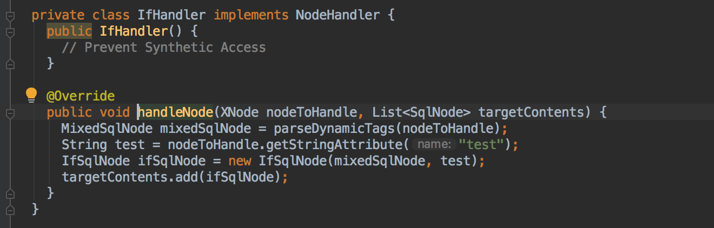
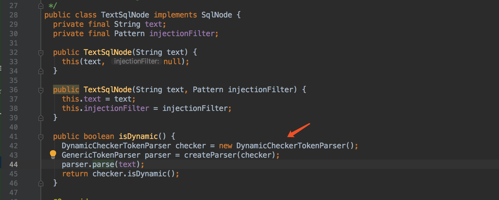
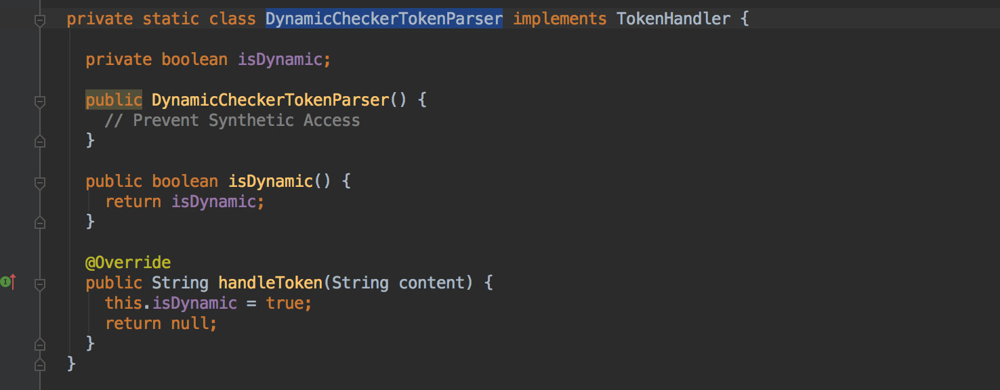

## 解析XMLScriptBuilder

### XMLScriptBuilder

解析sql语句里面的标签




XMLScriptBuilder内部逻辑主入口，最终返回对MixedSqlNode的封装，根据isDynamic决定具体SqlSource的实现类。




#### MixedSqlNode的生成逻辑



我去，<font color=red>node.newXNode()里面还有解析逻辑</font>，调试才看出来，怎么多了一次${}解析




构造方法中含有parseBody()方法，取数据，在PropertyParser进行一次操作。



```java
data = PropertyParser.parse(data, variables);//进行${}占位符的解析，解析内容为variables
// variable即为配置xml的properties节点，同时代码逻辑中有相关的优先级处理。
```


对于下级子标签处理，比较复杂，涉及到相关mybatis标签处理，以及**递归**的操作。

可以看IfHandler,对于自身再调用parseDynamicTags，<font color=red>对自己下层子标签再进行处理</font>，后续再读取自身属性，封装到IfSqlNode。



其他Handler类似处理。


#### XMLScriptBuilder的dynamic

对于文本节点，在TextSqlNode源码中可以看到，只要包含${}就会将DynamicCheckerTokenParser置为true，




DynamicCheckerTokenParser感觉作用只是以语句是否包含${}来定义isDynamic




如果当前节点存在子标签也会将isDynamic设为true


