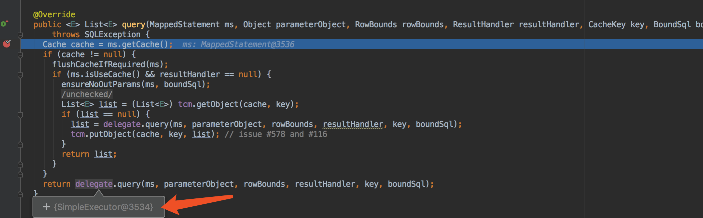

## mybatis sql执行分析1

### 核心

1. sqlSession执行crud操作，都是交给Executor去完成。
2. Executor的主要需要创建jdbc的statement，然后执行
3. 创建statement交给StatementHandler完成。
4. 如果需要参数设置，还需要用的类型转换TypeHandler
5. statementHandler执行sql，封装结果

### 实际分析

以SqlSessionTest的单测为例

sqlSession.selectOne进入到

查询处理交给Executor处理

Executor实现有

分析：

执行Executor的直接实现有两个

1. BaseExecutor

2. CachingExecutor

BaseExecutor

CachingExecutor的作用相对于BaseExecutor做一个代理者，提供缓存处理，自身缓存处理完，后续操作再交由BaseExecutor的具体实现进行完成。

本身做一个静态代理，最后交由BaseExecutor的继承类SimpleExecutor完成查询操作

对于BaseExecutor使用到了模版设计模式

参考：<http://www.cnblogs.com/qq-361807535/p/6854191.html>

首先进入SimpleExecutor父类BaseExecutor的query方法中，**BaseExecutor的query方法定义了查询操作的执行算法，包含了一些缓存操作，具体的查询操作是在具体子类的doQuery中实现。对应的子类有四个，见上面的uml图**

先不考虑缓存问题， 程序最终进入的BaseExecutor的queryFromDatabase()方法，根据方法命名即可知道是去数据库查询。

这里开始调用具体子类的 查询实现逻辑doQuery，这时进入SimpleExecutor的具体doQuery实现。

开始创建StatementHandler

StatementHandler对应于JDBC的statement，

RoutingStatementHandler作为一个代理者，为PreparedSatementHandler,CallableStatementHandler和SimpleStatementHanlder做代理。

RoutingStatementHandler的构造方法，进行选择代理对象，这里选择了prepared类型的。

接下来构建statement

交给handler进行构建

RoutingStatementHandler交给PreparedStatementHandler处理

同样和执行起Executor，使用了模版模式，进入BaseStatementHandler的prepare方法

进入instantiateStatement（）构建statement，具体的instantiateStatement由子类实现，这里是prepareStatementHandler，所以进入通过jdbc基本操作构建PreparedStatement对象

设置参数

依然通过RoutingStatementHandler代理到PreparedStatementHandler

PreparedStatementHandler交给ParameterHandler处理，使用默认实现DefaultParameterHandler处理。

开始处理参数，

jdbc的赋值操作 是交给TypeHandler处理的

依然是模版模式，具体的赋操作进入

这样赋完参数值。statement就构建完毕了。

代码再往下走

构建完jdbc的statement就很容易进行相关的查询操作。交给handler处理，同样通过RoutingStatementHandler代理到PreparedStatementHandler，

进入到PreparedStatementHandler，操作非常简单，最后处理结果集。

最后封装结果集。完毕

### 总结

学习到模版模式，mybatis几乎每个组件都用到了模版模式。里面还有很多细节没仔细分析，缓存，BoundSql，对应到Mapper解析的处理等等。sql执行过程过了一遍，