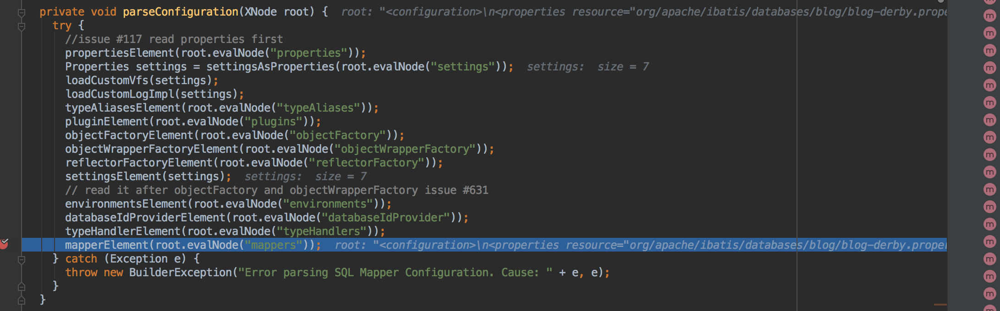

## mybatis 动态sql分析1

```xml
分析这条sql执行 select * from Blog where id = #{id} 如何转为 select * from Blog where id = ？
```

#### 分析

xml文件


先进入mapper解析




进入语句解析


转交XMLStatmentBuilder解析


parseStatementNode方法核心点，转给LanguageDirver，这里是XMLLanguageDirver。

第三个参数parameterTypeClass是前面读取参数，在typeAliase注册中心拿到的class


XMLLanguageDirver做一个透传，交给XMLScriptBuilder处理生成SqlSource


进入XMLScriptBulder解析方法


主要生成MixedSqlNode对象，再将MixSqlNode封装到SqlSource里面返回


MixSqlNode内部包含的是SqlNode的集合，<font color=red>这个目前不太清楚</font>


实例话TextSqlNode，再解析


GenericTokenParser作为一个解析xml中的占位符的解析器

对于${}占位符的解析


因为语句中不包含${}占位符,所以执行到这里结束。


dynamic就为false，后续代码进入到下图，实例话StaticTextSqlNode


因为仅仅包含一条sql，contents就包含一个StaticTextSqlNode，生成MiexedSqlNode对象返回


在XMLScriptBuilder中可以看到


执行过程中，未将dynamic属性更新为true，所以实例化RawSqlSource


实例化RowSqlSource， 先由sqlNode生成sql语句进入getSql()方法，


通过MixedSqlNode去遍历其内部的SqlNode，并执行对应的apply方法。


这里contents里面就一个StaticTextSqlNode


做了一个简单处理，用到了StringJoiner，处理比较简单。


建立SqlSourceBuilder，让他处理


和前面解析${}占位符一样， 这次解析#{}占位符，处理者为ParameterMappingTokenHandler实例


前面就是一些取占位符开始，结束的计算， 读到后交给ParameterMappingTokenHandler处理。


ParameterMappingTokenHandler作为参数映射处理者，将参数转为？并存储参数映射信息存到内存


最终完毕。