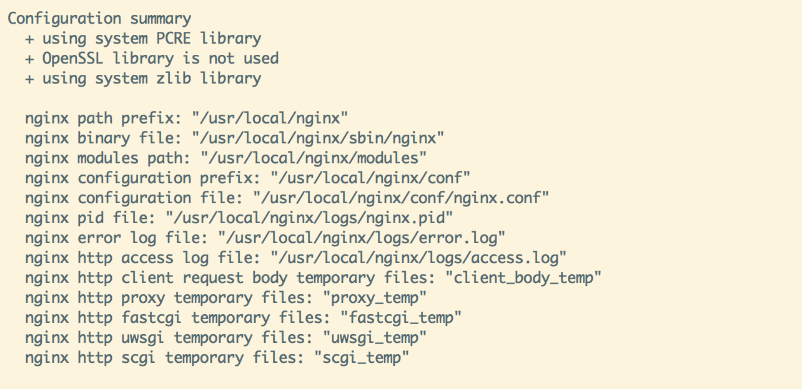

## nginx安装

##### 下载

去官网下载nginx gz包

##### 编译安装
解压gz，进入gz解压后的目录

检测

~~~shell
./configure --prefix=/usr/local/nginx
~~~

需要的一些lib

~~~shell
yum install zlib zlib-devel openssl openssl-devel pcre pcre-devel
~~~

正确后的效果，展示相关目录信息

编译安装

make

make install

##### 启动

~~~shell
cd /usr/local/nginx
./sbin/nginx
~~~

验证启动成功

curl http://localhost 或者浏览器打开nginx服务器地址

预期展示nginx默认页面

##### 停止

~~~shell
./sbin/nginx -s quit
~~~

~~~shell
ps -ef|grep nginx # 查询nginx主线程的pid
kill pid
~~~

##### 平滑重启

检测nginx.conf配置是否正确

~~~shell
./sbin/nginx -t -c 配置文件
正确显示
nginx: the configuration file /usr/local/nginx/conf/nginx.conf syntax is ok
nginx: configuration file /usr/local/nginx/conf/nginx.conf test is successful
~~~

平滑重启

~~~shell
./sbin/nginx -s reload
~~~

