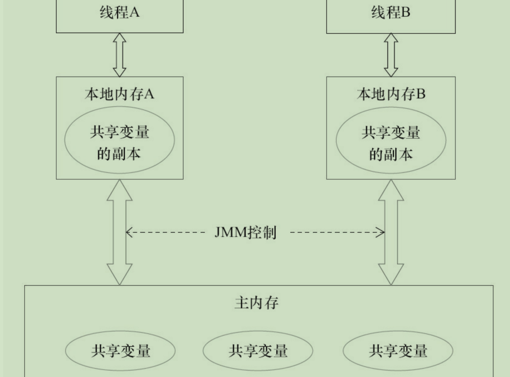

## java并发编程艺术 读书笔记2

#### volatile

相对于synchronized，volatile**不会**引起上下文切换，更加轻量级。

1. 无锁
2. 偏向锁
3. 轻量级锁
4. 重量级锁

### java内存模型 JMM

#### 两大问题

1. 线程通信
2. 线程同步

#### 两大解决

1. 共享内存
2. 消息传递

实例域，数组，静态域 具有 **内存可见性**

#### 内存模型

#### 重排序

happend-before

As-if-serial

#### 顺序一致性模型

解决重排序导致的线程不安全，