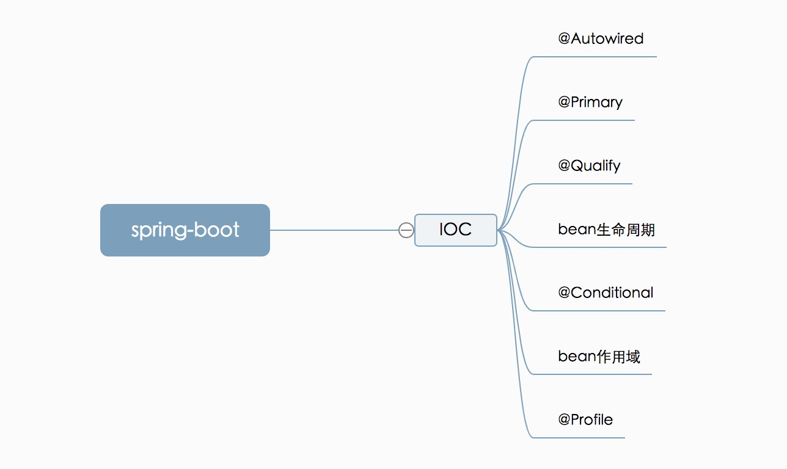
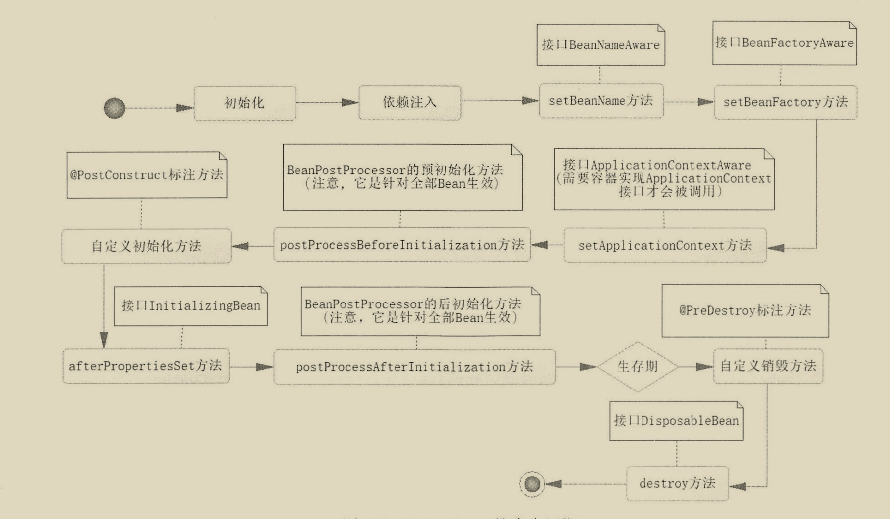
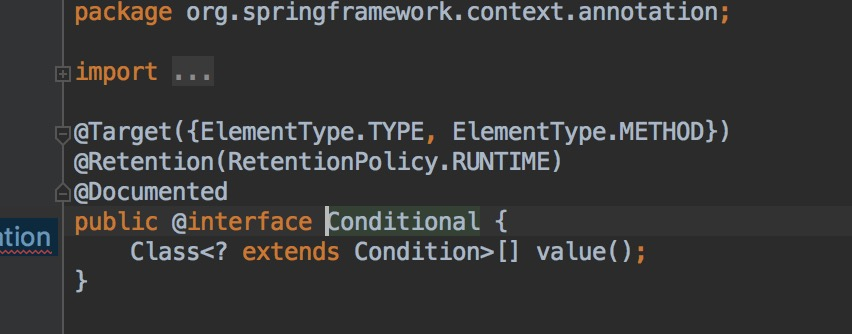
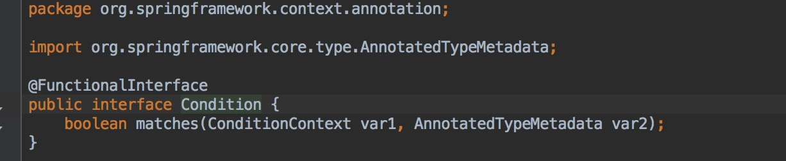

## 深入浅出SpringBoot2笔记

#### 开始

​	spring主要成就在于提出了一些理念，这些理念的影响远大于其技术实现的。

 	1. 控制反转
 	2. 面向切面

​	beanFactory：作为ioc容器的接口，所有ioc容器必须继承BeanFactory，但是BeanFactory的功能不够完善，于是有了ApplicationContext作为其子类，扩展。诸如，提供国际化等等额外功能。

#### @Autowired注解：

##### @Autowired注入流程

​	先根据类型注入，如果类型无法确定唯一，再根据属性名。如果属性名依然无法唯一确定对象，则抛出异常。

	##### @Primary

​	同时如果对某一属性，存在多个符合注入条件的对象，可以通过@Primary注解，指定优先使用某一个对象。

	##### @Qualify

​	对于@Primary注解，其可以存在多个对象上。如果，某个@Autowired注解的属性，因包含多个@Primary标注的对象，也会导致@Autowired注解的属性无法确定需要注入的具体对象。

​	这个时候可以通过对@Autowired标注的属性，额外加上@Qualify注解来进一步指定。

#### bean生命周期

#### @Conditional

提供条件注入bean，满足一定条件即可注入对应的bean。如：检查某些配置是否完善，完善后才可以进行注入。

对应value填写 实现了Condition接口的类。

#### bean作用域

​	作用域：是指一个bean存活的范围。

#### @Profile

​	对应需要配置spring.profile.active和spring.profile.default,如果两者均没配置，则@Profile标注的注解将不会被注入到ioc容器中。

​	spring.profile.active的优先级>spring.profile.default